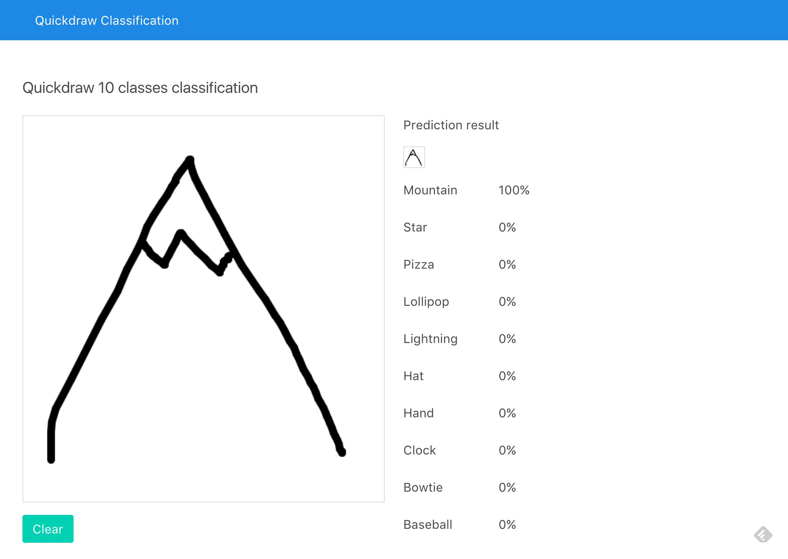

Quickdraw 10 CNN Classifier
===

## Demo

:point_right: [https://quickdraw-10-classification.herokuapp.com/](https://quickdraw-10-classification.herokuapp.com/)

## Introduction

This project is demo project that getting hand-drawing image and try to classification which kind of image of input.



It is machine learning project to classify [Google Quickdraw image](https://github.com/googlecreativelab/quickdraw-dataset) just only 10 classes with convolutional neural networks using [Keras](https://keras.io/) and [Tensorflow](https://www.tensorflow.org).<br>
And also serve hand-writting website with [Flask](http://flask.pocoo.org/)


## Website Usage

1. Compose Docker

```
docker-compose up
```

2. Start `http://localhost:8000`

Basicly, Flask website view download model from `model` folder which I've provided pre-trained model `model-v1.h5` and serve to website.

You can train new model with `docker-compose up -f docker-compose.train.yml` to start Jupyter notebook and customize code and run by yourself then save to `model` directory and replace the old model if you want to or change the code in `web` folder for better choice.

## Model Usage

### Training Data Preparation

Enter these command to automatic download training dataset

```
chmod +x ./data-download.sh
./data-download.sh

# Or
docker-compose exec quickdraw ./data-download.sh
```

### Jupyter Usage

```
docker-compose up -f docker-compose.train.yml
```

## Heroku Deployment

```
heroku container:login
heroku create
heroku container:push web
heroku open
```

## License

[MIT](LICENSE) © Kosate Limpongsa
